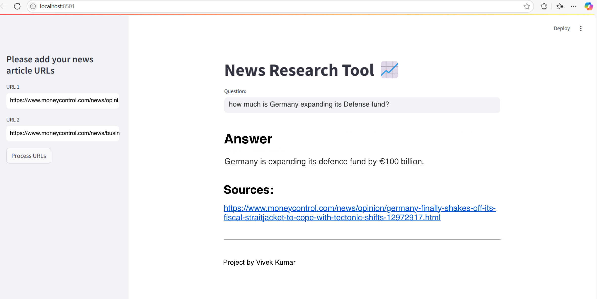

# News Research Tool Dashboard

This News Research Tool Dashboard is an intuitive tool designed using Python's Streamlit library to streamline information retrieval. Users can input article URLs and ask questions to get relevant insights using LangChain, OpenAI embeddings, and FAISS for efficient data management.



## Features

- Load URLs to fetch article content.
- Perform web scraping using LangChain's Unstructured URL Loader.
- Create embedding vectors using OpenAI embeddings and apply FAISS for effective similarity search and retrieval.
- Interact with the LLM (ChatGPT) by submitting queries and receiving accurate answers along with source URLs.


## Installation

- Clone the Repository: Download the repository to your local machine.
- 
- Install Dependencies: Ensure you have Python installed, then install the required packages using:
  ---
## Usage/Examples

- Run the Streamlit app by executing:
```
pip install -r requirements.txt
---

- Set Up OpenAI API Key: Create a .env file in the project root and add your OpenAI API key using the format:
---
OPENAI_API_KEY=your_api_key_here
---
-Run the Application: Execute the following command to launch the Streamlit app:
---
streamlit run main.py
---

streamlit run main.py

```

- Start the Application:The web app will open in your browser.

- Input URLs: On the sidebar, input two URLs for analysis.

- Process URLs: Click on "Process URLs" to load and analyze the articles. The content will be split using LangChain's RecursiveCharacterTextSplitter.

- Generate Embeddings: FAISS will build and store the embedding vectors using OpenAI's embedding model.

- Ask Questions: Enter any relevant question, and the LLM will generate responses based on the analyzed content.

- The embeddings will be stored and indexed using FAISS, enhancing retrieval speed.

- View Sources: The dashboard will provide the source URLs used to generate the response.

- In this case, i used following news articles
  - https://www.moneycontrol.com/news/opinion/germany-finally-shakes-off-its-fiscal-straitjacket-to-cope-with-tectonic-shifts-12972917.html
  - https://www.moneycontrol.com/news/business/companies/centre-says-quashing-volkswagen-s-1-4-billion-tax-bill-would-be-catastrophic-12972698.html

## Project Structure

- main.py: The main Streamlit application script.
- requirements.txt: A list of required Python packages for the project.
- faiss_store_openai.pkl: A pickle file to store the FAISS index.
- .env: Configuration file for storing your OpenAI API key.
